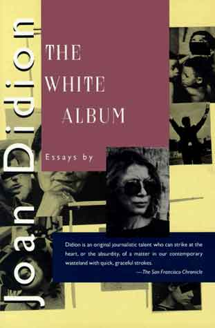
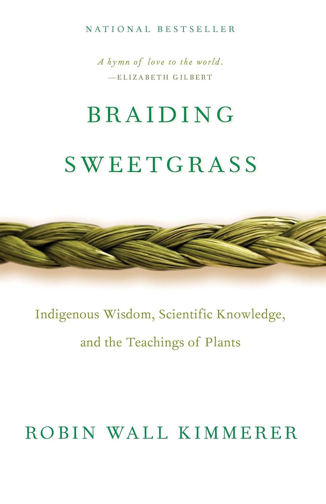
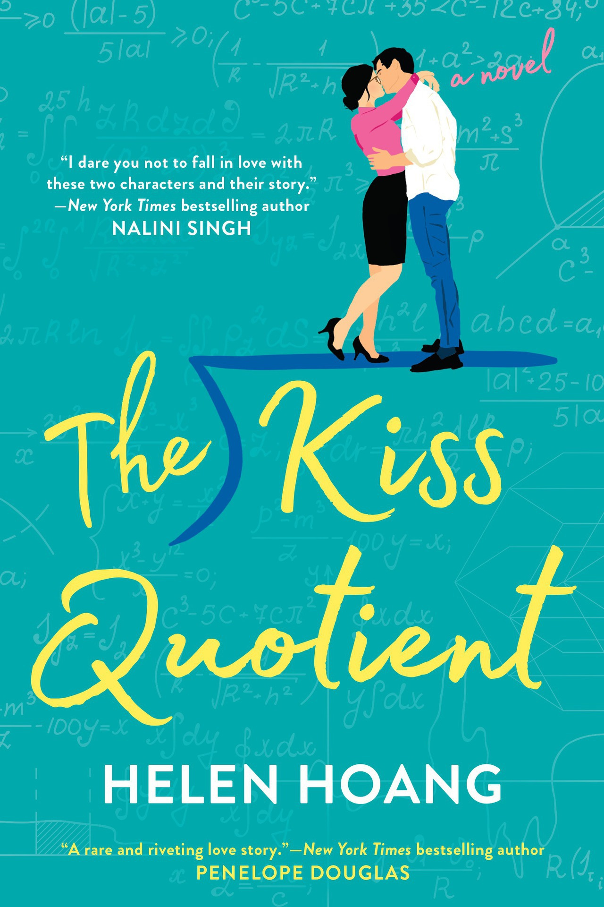
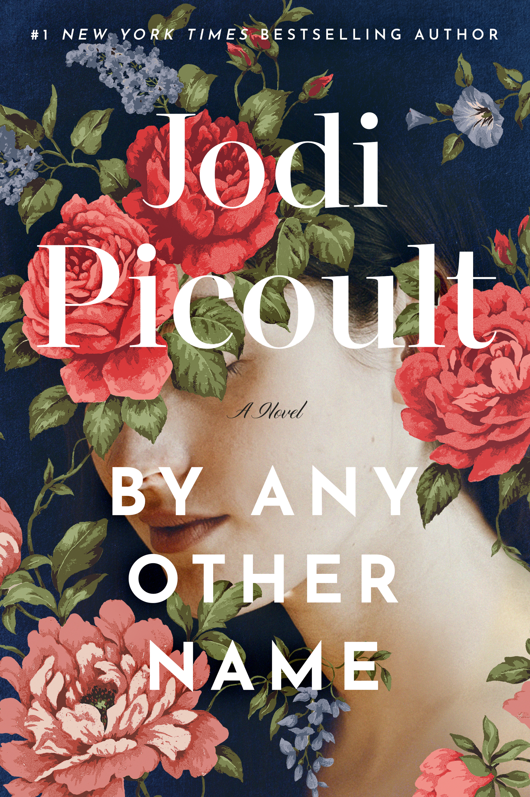

```{r setup, include=FALSE}
knitr::opts_chunk$set(echo = TRUE)
```

# Introduction

For the past few years I've challenged myself to read one more book per year than the last. It's been great motivation, but I've found myself getting a bit bored in my reading patterns. So this year I've designed a new challenge: one book per month - 12 books total - each with a different theme chosen by a friend or family member.

As I solicited themes and genres from my loved ones, I was surprised at just how creative people got with the themes - and how many people wanted to join me in my quest!

# The Challenges

<style>
.reading-table {
  width: 100%;
  border-collapse: collapse;
  font-family: "Montserrat", sans-serif;
  font-size: 1.05rem;
  margin: 1em 0;
}

.reading-table th {
  background-color: #264653;
  color: white;
  padding: 10px;
  text-align: left;
  font-family: "Gelasio", serif;
  font-size: 1.1rem;
}

.reading-table td {
  border: 1px solid #D3D3D3;
  padding: 10px;
  background-color: #FAFAFA;
  color: #1F1F1F;
}

.reading-table tr:nth-child(even) td {
  background-color: #F4F4F4;
}

.bonus-section {
  margin-top: 2em;
  font-family: "Montserrat", sans-serif;
  font-size: 1.05rem;
}

.bonus-section ul {
  padding-left: 1.2em;
}

.bonus-section li {
  margin-bottom: 0.5em;
}
</style>

### 📚 2025 Monthly Reading Challenge

<table class="reading-table">
  <thead>
    <tr>
      <th>Month</th>
      <th>Prompt</th>
    </tr>
  </thead>
  <tbody>
    <tr><td>January</td><td>A short story or essay in your career field or a field you are interested in.</td></tr>
    <tr><td>February</td><td>A book with a color, plant, or food in its name.</td></tr>
    <tr><td>March</td><td>Smut – or romance if that’s more your vibe.</td></tr>
    <tr><td>April</td><td>A book that altered someone’s brain chemistry.</td></tr>
    <tr><td>May</td><td>A middle grade book.</td></tr>
    <tr><td>June</td><td>A book by a trans/non-binary author.</td></tr>
    <tr><td>July</td><td>A book that made someone cry.</td></tr>
    <tr><td>August</td><td>A book by a debut author.</td></tr>
    <tr><td>September</td><td>A book on the banned books list.</td></tr>
    <tr><td>October</td><td>Something based in Greek, Chinese, Scandinavian or Russian mythology.</td></tr>
    <tr><td>November</td><td>A book that was made into a movie that you haven’t read or seen.</td></tr>
    <tr><td>December</td><td>A book that was not originally written in English.</td></tr>
  </tbody>
</table>

<div class="bonus-section">
### 🌟 Bonus Books

  - *Lady Tan’s Circle of Women* (Kat)  
  - A book written by **Shelby Cleland**  
  - Go to your last 5-star read on Goodreads, then go to that author’s page, and read another one of their 5-star rated reads. (Shelby)  
  - A book with recipes in it that is **not a cookbook** (Haley)  
    + Specific recommendation: *Mad Honey*
</div>


# Monthly Recaps

## January: A short story or essay in your career field or a field you are interested in.

```{=html}
<div class="reading-recap">
  <div class="book">
    
  </div>
  <div>
    <p><strong>Theme suggested by:</strong> Kalani</p>
    <p><strong>What I read:</strong> Holy Water by Joan Didion</p>
  </div>
</div>
```


**Why I picked it:** This book was suggested by a friend of mine that used to work in a similar field (water). I also started this theme late in the month, and a short read was just what I needed.

**My thoughts:** Didion opens, "Some of us who live in arid parts of the world think about water with a reverence others might find excessive." This was not the case for my household. I was raised to believe that water simply came from the tap - and never gave any thought to where it came from before it made it to my kitchen sink. So long as the faucet worked, nothing else really mattered. This is in stark contrast to the field I work in now, where I not only give great thought to where a utility's water comes from, but am constantly working towards accounting for every last drop.

Didion's essay is a poetic reflection on the physical movement of water through the arid state of California, and how this all-important aspect of life balances on a thin edge of control, dictated by a myriad of agencies: "Los Angeles moves some of it, San Francisco moves some of it, the Bureau of Reclamation's Central Valley Project moves some of it, and the California State Water Project moves most of the rest of it, moves a vast amount of it, moves more water farther than has ever been moved anywhere."

But what really struck me in this essay was a singular line: "The apparent ease of California life is an illusion, and those who believe the illusion real live here in only the most temporary way." I've re-read this line a hundred times, and it captures the essence of Southern California in such a stark, raw way. Life in California is by no means easy, and those who do believe it to be so are those who only pass through - they don't stay. 

While I may have not understood the significance of the water making its way to my tap as a child, I did have an inkling that not many people who came to California stay. The Los Angeles elite I saw on TV had no idea a little girl from the desert a hundred miles away watched them, and after their red carpet event, they'd jet away to the next location with no thought to the complex network of waterworks that made their event possible, just as I gave no thought to the water in my kitchen tap.


## February: A book with a color, plant, or food in it’s name.

```{=html}
<div class="reading-recap">
  <div class="book">
    
  </div>
  <div>
    <p><strong>Theme suggested by:</strong> Kat</p>
    <p><strong>What I read:</strong> Braiding Sweetgrass by Robin Wall Kimmerer</p>
  </div>
</div>
```

**Why I picked it:** This book had been a work in progress for me for almost a year. I figured this month's theme was the perfect motivation I needed to actually finish it.

**My thoughts:** This book was beautifully written, but I also have realized that I struggle to read long form non-fiction. I had started the book in 2024, and had fallen asleep nearly every time I read it. 

It was once I realized that I needed to take each chapter as a sort of short-form essay that I began to make progress. Each chapter is in itself a beautiful piece of writing, but when woven together with the other chapters in its section, make a cohesive whole, just as the sweetgrass stalks are woven together in Kimmerer's stories. 

I am left after reading this book with a feeling of great respect for this work, but the feeling that I missed much of the message. I think I'll have to slowly re-read this book with my piecemeal methodology to further digest the meaning and calls to action. 


## March: Smut - or romance if that’s more your vibe.

```{=html}
<div class="reading-recap">
  <div class="book">
    
  </div>
  <div>
    <p><strong>Theme suggested by:</strong> Frankie</p>
    <p><strong>What I read:</strong> The Kiss Quotient by Helen Hoang</p>
  </div>
</div>
```


**Why I picked it:** I received this book as the result of a *spicy* book exchange for Galentine's day.

**My thoughts:** Loved this. It is definitely *not* PG, but the spicy scenes were slow-burning and, for lack of a better term, kinda wholesome? (Gotta love consent!) 


## April: A book that altered someone’s brain chemistry.

```{=html}
<div class="reading-recap">
  <div class="book">
    
  </div>
  <div>
    <p><strong>Theme suggested by:</strong> Haley</p>
    <p><strong>What I read:</strong> By Any Other Name by Jodi Picoult</p>
  </div>
</div>
```


**Why I picked it:** I LOVE me some Shakespeare and a great historical conspiracy theory. I am also a fan of female-centered stories, so the description of this one was right up my alley.

**My thoughts:**


