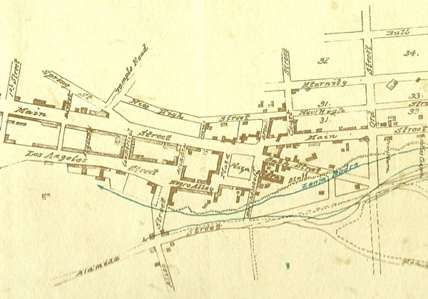
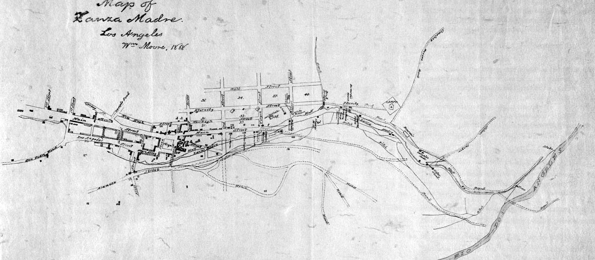
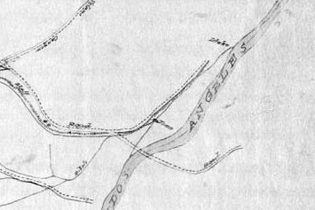
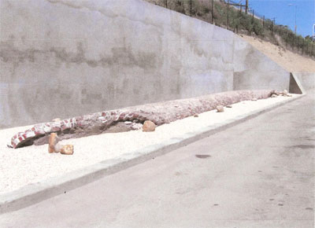
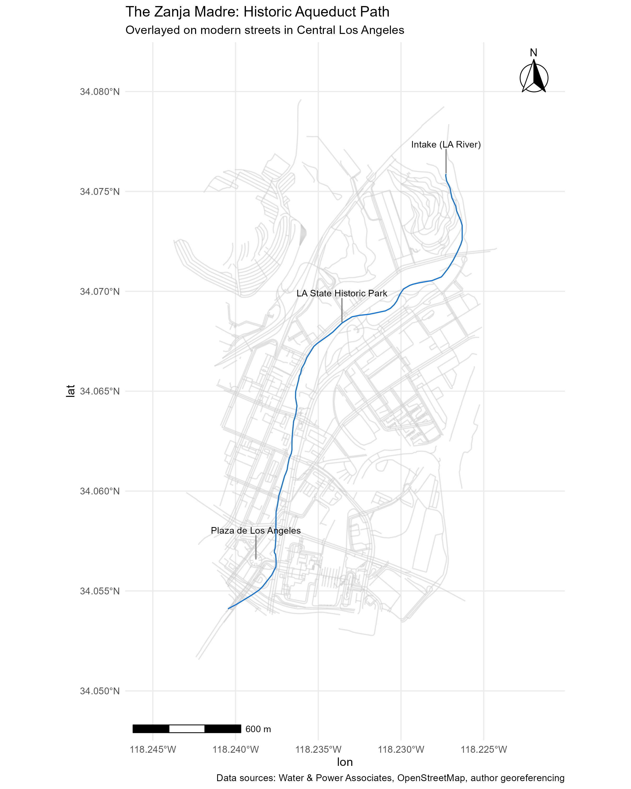

```{r setup, include=FALSE}
knitr::opts_chunk$set(
  echo = TRUE,
  warning = FALSE,
  message = FALSE)
```

# Introduction

The art of maps has a certain poetry about it when viewed in historical contexts and across decades. This, to me, is even more true when using historical maps to find lost features in today's world. 

For this project, I wanted to take this storytelling spin to a historical place near me. Much of my life and work revolves around my own area in Santa Barbara, so I decided to go outside of my usual haunts to a place I wasn't as familiar with (and, admittedly, had much easier access to historic records) - Los Angeles.

I was also inspired by this video by Daniel Steiner. In it, they touch briefly on the Zanja Madre, which translates to "mother ditch." This small brick aqueduct was the original lifeline from the Los Angeles River to the Pueblo de los Angeles.


<a href="http://www.youtube.com/watch?feature=player_embedded&v=wpXMK-Mixds
" target="_blank"></a>


This really got my wheels turning, because it all comes back to the foundational need of any civilization: water. And as it just so happens, that's a topic I am professionally very interested in. 

I will start with tracing the path and history of the Zanja Madre. With my newly-acquired georeferencing skills, I hope to expand this project to other forgotten creeks and waterways of LA in the future.


# Zanja Madre

## Historical Maps

The basis of my exploration comes from the [Water and Power Associates Website](https://waterandpower.org/index.html), and it's article on the Zanja Madre. Specifically, the article provides two historical hand-drawn maps:







Most distinctively, the Plaza de los Angeles is visible in the center of both of these maps, in the area where the plaza still resides today. I digitally georeferenced these maps using QGIS in the next step, in order to create a digital path of the Zanja Madre for visualization in today's world.


## Georeferencing

I utilized QGIS to georeference multiple points within each map. I won't detail every step here, but I highly recommend this video from Felt, whose steps I followed exactly:

<a href="http://www.youtube.com/watch?feature=player_embedded&v=XV62QEk0Cxg
" target="_blank"></a>


And here is where I ran into a little bit of trouble. Georeferencing the first map from the 1860s resulted in a rather distorted map view, which makes sense because the original map itself represents a very small area (only a few city blocks), which naturally would result in some distortion when looking at a much larger-scale map. Ultimately I utilized the second map from the 1880s as my basis for creating a digital version of the path of the Zanja Madre, especially because we can see at the very right hand side of the map (which would actually be to the north IRL) a small note where the Zanja meets the Los Angeles river, saying "Intake". Or at least that's what I think it says.



## IRL

To my utter excitement (yes I'm a nerd, I know), [part of the Zanja Madre is still visible today.](https://www.google.com/maps/place/34%C2%B004'06.7%22N+118%C2%B014'00.1%22W/@34.0694165,-118.23158,1868m/data=!3m1!1e3!4m4!3m3!8m2!3d34.0685278!4d-118.2333611?entry=ttu&g_ep=EgoyMDI1MDgyNS4wIKXMDSoASAFQAw%3D%3D) 



This segment on the northwest side of Los Angeles State Historic Park did not align with the digital Zanja Madre line taken purely from the hand-drawn historical maps I used to georeference. To adjust this, I manually moved the line segment of the Zanja passing through this area in my digital drawing. While this introduces potential error, my goal was ultimately to create a line layer that makes sense in the terms of today's geography as we understand it. 


## History Meets the Map

```{r load-zanja, message=FALSE, warning=FALSE}
library(sf)
library(ggplot2)
library(ggspatial)
library(osmdata)
library(ggrepel)
library(dplyr)
library(tidyverse)


# 1. Load Zanja Madre
zanja <- st_read("zanja_madre.geojson", quiet = TRUE) %>%
  st_transform(4326)  # ensure WGS84 for plotting with OSM
```


```{r zanja-map}

# 2. Calculate bounding box with padding
zanja_bbox <- st_bbox(zanja)
xlim <- c(zanja_bbox["xmin"] - 0.005, zanja_bbox["xmax"] + 0.005)
ylim <- c(zanja_bbox["ymin"] - 0.005, zanja_bbox["ymax"] + 0.005)


# 3. Download OSM streets for context
streets <- opq(bbox = zanja_bbox) %>%
  add_osm_feature(key = "highway") %>%
  osmdata_sf()

streets_lines <- streets$osm_lines %>% st_transform(4326)


# 4. Define key landmarks for annotations
annotations <- tibble(
  name = c("Plaza de Los Angeles", "Intake (LA River)", "LA State Historic Park"),
  lon  = c(-118.2387693, -118.2272778, -118.2335699),
  lat  = c(34.0565381, 34.0758661, 34.0684077)
)

# 5. Build the ggplot map
zanja_plot <- ggplot() +
  # faint streets
  geom_sf(data = streets_lines, color = "gray80", size = 0.3, alpha = 0.5) +
  # Zanja Madre line
  geom_sf(data = zanja, color = "dodgerblue3", size = 1.5, linetype = "solid") +
  # key landmarks
  geom_text_repel(
    data = annotations,
    aes(x = lon, y = lat, label = name),
    size = 3,
    nudge_y = 0.0015,
    segment.color = "gray50"
  ) +
  # coordinate zoom
  coord_sf(xlim = xlim, ylim = ylim) +
  # scale & north arrow
  annotation_scale(location = "bl", width_hint = 0.3) +
  annotation_north_arrow(location = "tr", which_north = "true",
                         style = north_arrow_fancy_orienteering) +
  # clean theme
  theme_minimal() +
  labs(
    title = "The Zanja Madre: Historic Aqueduct Path",
    subtitle = "Overlayed on modern streets in Central Los Angeles",
    caption = "Data sources: Water & Power Associates, OpenStreetMap, author georeferencing"
  )

# Save to PDF
# ggsave("zanja_madre_map.pdf", plot = zanja_plot, width = 8, height = 10)

# Save to PNG
# ggsave("zanja_madre_map.png", plot = zanja_plot, width = 8, height = 10, dpi = 300)


```




Notice here how the Zanja curves through the historic Plaza de los Angeles and passes near what is now the State Historic Park and the railway.

[Download a high-resolution PDF of the Zanja Madre map](zanja_madre_map.pdf)


## The Zanja Through Time

```{r}
library(leaflet)
library(raster)
library(sf)
library(tidyverse)

# Landmark popups
annotations <- tibble(
  name = c("Plaza de Los Angeles", "Intake (LA River)", "LA State Historic Park"),
  lon  = c(-118.2387693, -118.2272778, -118.2335699),
  lat  = c(34.0565381, 34.0758661, 34.0684077),
  popup = c(
    "<b>Plaza de Los Angeles</b><br>Heart of the original Pueblo. People would gather here to fetch water, socialize, or even wash clothes directly in the ditch.",
    "<b>Intake (LA River)</b><br>The Zanja Madre drew water here from the Los Angeles River. The river itself is now paved and permanent, but through time has shifted locations multiple times.",
    "<b>LA State Historic Park</b><br>Part of the Zanja is still visible here."
  )
)

# Digitized Zanja line
zanja <- st_read("zanja_madre.geojson", quiet = TRUE) %>% 
  st_transform(4326)

# Load and crop/downsample historical rasters
map1860 <- raster("Zanja_Madre_Map_1860s_modified.tif")
map1880 <- raster("Zanja_Madre_Map2_modified.tif")

# Ensure single layer (RasterLayer)
map1860 <- map1860[[1]]
map1880 <- map1880[[1]]

# Reproject to WGS84 if needed
map1860 <- projectRaster(map1860, crs = "+proj=longlat +datum=WGS84")
map1880 <- projectRaster(map1880, crs = "+proj=longlat +datum=WGS84")

# Crop to Zanja bounding box
zanja_bbox <- st_bbox(zanja)
crop_extent <- extent(zanja_bbox$xmin, zanja_bbox$xmax,
                      zanja_bbox$ymin, zanja_bbox$ymax)
map1860_crop <- crop(map1860, crop_extent)
map1880_crop <- crop(map1880, crop_extent)

# Downsample for performance
map1860_crop <- aggregate(map1860_crop, fact = 8)
map1880_crop <- aggregate(map1880_crop, fact = 8)

# Save as PNG
writeRaster(map1860_crop, filename="map1860_crop.png", format="PNG", overwrite=TRUE)
writeRaster(map1880_crop, filename="map1880_crop.png", format="PNG", overwrite=TRUE)


# Leaflet interactive map
m <- leaflet() %>%
  addTiles(group = "Modern Map") %>%   # base map
  addRasterImage(map1860, colors = gray.colors(256), opacity = 0.85, group = "1860s Map") %>%
  addRasterImage(map1880, colors = gray.colors(256), opacity = 0.85, group = "1880s Map") %>%
  addPolylines(data = zanja, color = "dodgerblue", weight = 3, opacity = 0.8, group = "Zanja Madre") %>%
  addMarkers(
    data = annotations,
    ~lon, ~lat,
    popup = ~popup,
    label = ~name
  ) %>%
  addLayersControl(
    baseGroups = c("Modern Map"),
    overlayGroups = c("1860s Map", "1880s Map", "Zanja Madre"),
    options = layersControlOptions(collapsed = FALSE)
  ) %>%
  fitBounds(
    lng1 = min(annotations$lon)-0.002, lat1 = min(annotations$lat)-0.002,
    lng2 = max(annotations$lon)+0.002, lat2 = max(annotations$lat)+0.002
  )

htmltools::browsable(m)
```


Toggle between the 1860s and 1880s layers to see how the city has changed through time, and where the Zanja might be today. 


# Reflections

Given the scale of Los Angeles' water infrastructure today, the Zanja Madre may seem small. But it was once the lifeblood of Los Angeles when it was still a growing pueblo. Mapping its path through both historical maps and modern streets shows how water shaped the city, influenced settlement patterns, and continues to leave traces in the urban landscape. Geospatial storytelling allows us to uncover these hidden histories and connect past and present in ways that static words alone cannot.


# Next Steps

This project is the first step in exploring Los Angeles’ forgotten waterways. Future maps will trace other lost creeks, revealing the hidden network of water that underpins the city today.
