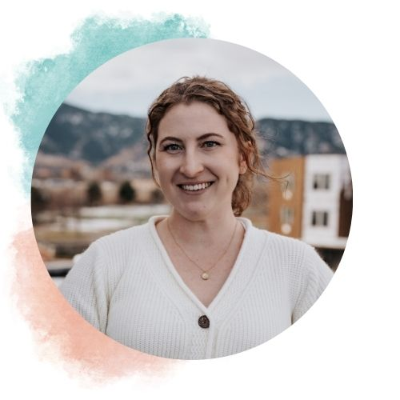

<!-- {width=50px} -->

# Welcome!

Hello! I am an environmental data scientist with a passion for using sound data science and GIS tools to efficiently manage scarce resources in the face of a changing climate. 

# Bio

I currently work as an Analyst with E Source in the Water Loss Consulting division. Through this work, I directly assist water utilities across the U.S. in understanding their distribution system and billing data by analyzing complex databases and performing audits of water supply, distribution and consumption. This information helps agencies meet regulatory standards and reduce the amount of water that goes unaccounted for, and is therefore considered "lost."

<!-- I received a Masters of Environmental Science and Management in 2022 from the UC Santa Barbara Bren School of Environmental Science & Management. My master's group project (thesis equivalent) involved analyzing the spatiotemporal dynamics of acoustic pinniped deterrents (dubbed "seal bombs") in the squid fishing industry, and their potential effects on acoustically sensitive migratory cetaceans. During my grad school career, I also worked as an Arnhold Graduate Fellow in conjunction with emLab and Conservation International utilizing projected climate scenarios to anticipate future areas of increased human-wildlife conflict in Sub-Saharan Africa. Prior to graduate school, I obtained my Bachelor of Science in Environmental Studies as a Regents Scholar from UC Santa Barbara in 2018. -->

My general interests include water conservation, spatiotemporal dynamics driven by climate scenarios, and storytelling using GIS tools and maps. Outside of this work, I love being on the ocean with my outrigger paddling team, baking, and all things outdoors. 

